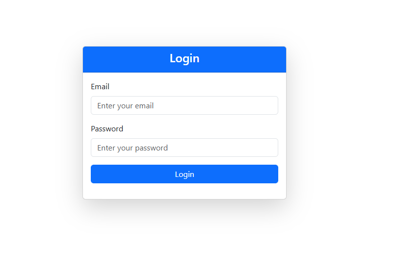
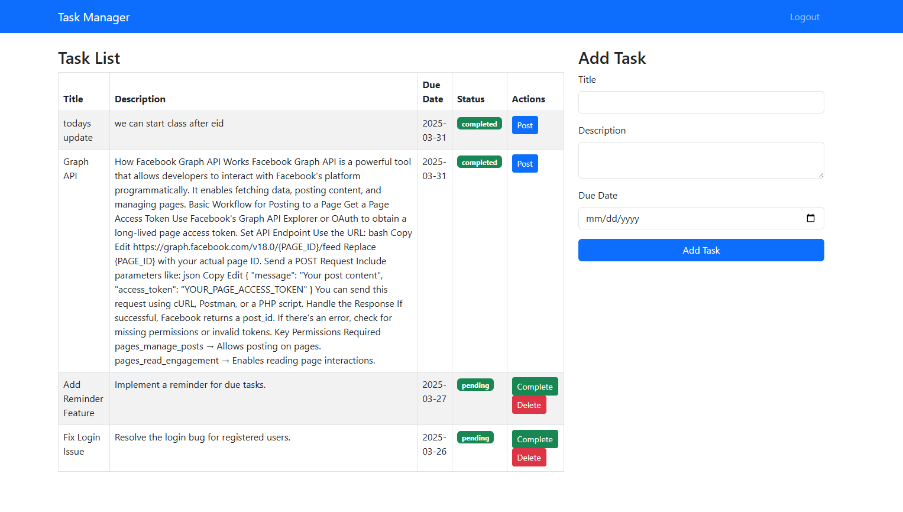
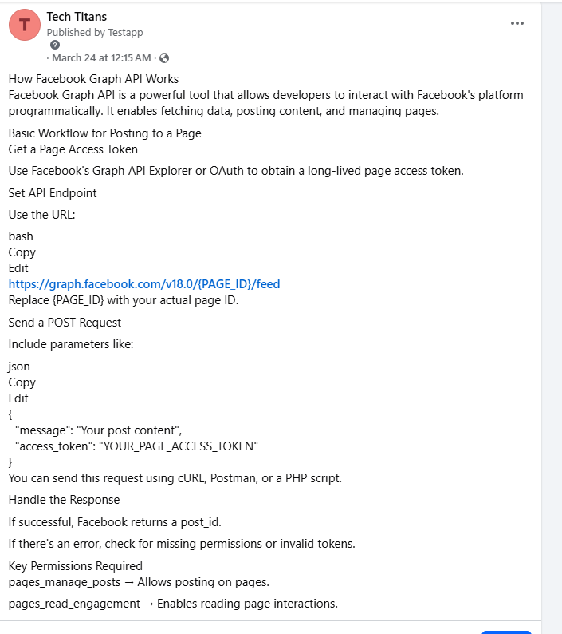

# Task Manager Project Setup

1.  **Clone the Repository:**
    ```bash
    git clone [https://github.com/ApelSarkar/Task-Manager](https://github.com/ApelSarkar/Task-Manager)
    ```

2.  **Import the Database:**
    * Import the database provided within the GitHub repository.

3.  **Start the PHP Development Server:**
    ```bash
    php -S localhost:8080
    ```

4.  **Access the Login Page:**
    * Open your web browser and navigate to:
        ```
        http://localhost:8080/views/login.php
        ```

5.  **Login Credentials:**
    * Username: `apel@gmail.com`
    * Password: `123456`

6.  **Facebook Integration (Page ID and Access Token):**
    * **Option 1: Using the `.env` file (Recommended):**
        * Add your Facebook Page ID and Access Token to the `.env` file.
        * Example `.env` content:
            ```
            FACEBOOK_PAGE_ID=your_page_id
            FACEBOOK_ACCESS_TOKEN=your_access_token
            ```

    * **Option 2: Directly in `TaskController.php`:**
        * Alternatively, you can directly add your Page ID and Access Token into the `postToFacebook` function within the `TaskController.php` file.
        * Replace placeholder values within the function.


    
    
    